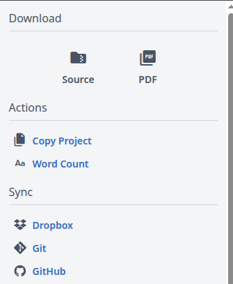
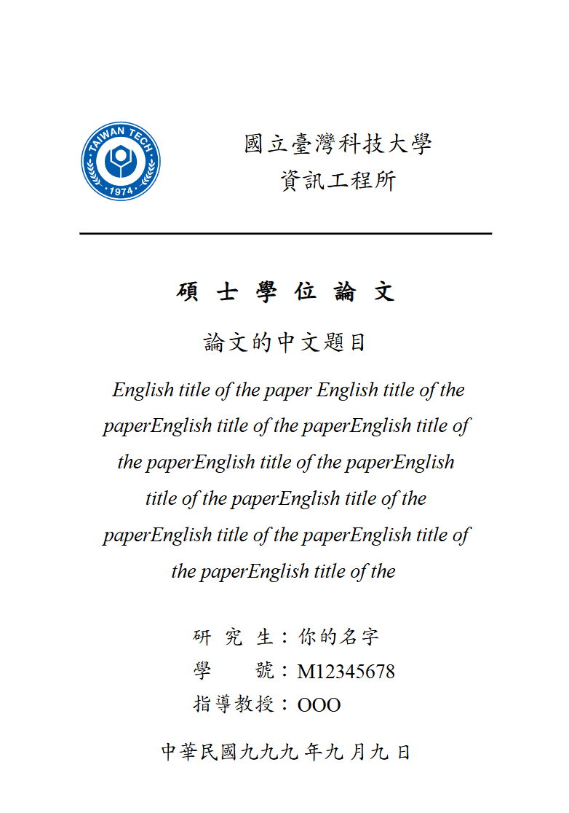

# NTUST 碩士論文 LaTeX 範本

本專案為國立臺灣科技大學碩士論文撰寫之 LaTeX 模板，提供完整章節架構、繁體中文樣式、插圖表展示、文獻引用格式與中英文摘要樣式。適合研究生、助教與課程教學使用。

## 專案結構

```txt
│  environment.tex
│  frontmatter.tex
│  main.tex
│  ntust.png
│  README.md
│  references.bib
│  titlepage.tex
│
├─ appendix
│      appendix.tex
│      AppendixA.tex
│      AppendixB.tex
│
├─ chapters
│      1_common_cmd.tex
│      2_markdown_syntax.tex
│      3_tab_pic.tex
│      4_algo_fragment.tex
│      5_ref.tex
│
├─ figures
│      overleaf.png
│      template-arch.png
│      template-flowchart.png
│      titlepage.png
│
└─ front-matter
        acknowledge.tex
        en_abstract.tex
        zh_abstract.tex
```

## 使用說明

1. 編譯方式建議使用 XeLaTeX（支援中文與字型）
2. 修改 `titlepage.tex` 填入你的論文資訊
3. 修改 `front-matter/` 內容為正文前的摘要、致謝、目錄、口試申請書等內容
4. 修改 `chapters/` 內容為你的研究章節
5. 開啟 `main.tex`，載入你的論文章節

本範本在 [Overleaf](https://www.overleaf.com/read/mbytjqbxmsws#d67b90) 可以預覽，無需安裝任何環境。

打開範本的網址後，左上角的 Menu 點開，Copy Project 就可以複製一份到你的編輯區域了



## 檔案範例

在 Chapters 中，介紹了 LaTeX 的基礎語法：

- [X] 如何引用其他 `.tex` 檔案並編譯
- [X] 對應 Markdown 的一些基礎與法
- [X] 圖片與表格範例
- [X] 插入pseudo code演算法與程式範例
- [X] ref與cite
- [X] BibTeX 文獻管理，範例顯示 RFC、IEEE、技術文件與網站引用
- [X] 中英文樣式切換（`\UseChineseStyle` 以及 `\UseEnglishStyle`）
  - *bibType* 可以使用 zhbib 輸出「參考文獻」，或是 enbib 輸出「References」

絕大多數的想要修改輸出的內容都可以在 `environment.tex` 客製化，目前的範例只是使用台科大的規格當作範例去設定，參考[台科大論文格式](https://etheses.lib.ntust.edu.tw/media/download/ed6370c8-7c81-11ee-b999-0242ac1f0806.pdf)

## 注意事項

- 範例中，圖片放於 `figures/` 目錄，建議使用 `.png`、`.jpg` 或 `.pdf` 格式
  - 如果希望區分不同章節用到的圖片，可以額外建立如 `figures/introduce`，`figures/method` 等資料夾
  - 對於其他素材，比方說你有 plot 的原始檔案，或是想要存放一些 log，也可以直接新增 `log`, `assets` 等資料夾
- 若出現中文顯示問題，請確認使用 XeLaTeX 編譯器
- 本模板使用 AR PL 字型系列，Overleaf 可正常支援，如需自訂字體請修改 `environment.tex`

## 常見問題

- 我有多個指導教授 (共同指導)

> `titlepage.tex` 找到作者區塊，使用 `\InfoLine{指導教授}{其他教授名稱}` 可以插入其他資訊

- 我的題目比較長，或者我想調整封面的排版

> 目前應該允許稍微長一點的題目，比方說如下所示範。如果感覺還是不夠的話，可以嘗試調整 `titlepage.tex` 題目的字體大小。
> 每個區塊之間目前都使用 `\vspace` 來設定 margin，如果有需要的可以調大一點或調小一點。甚至可以考慮直接重寫整個 `\makeTitlepage` 的功能，來建立你自己的論文封面頁



- 想要調整邊界、範圍、文字大小等

所有的設定都在 `environment.tex` 可以進行調整，包含這些資訊

### `environment.tex` 可調整項目

所有排版與樣式的設定皆集中於 `environment.tex` 中進行統一配置，以下為可調整內容：

#### 浮水印設定

- `scale`：浮水印圖片縮放比例（例如 `0.5`）
- `angle`：旋轉角度（例如 `0` 表示不旋轉）
- `opacity`：透明度（0~1，數值越小越透明）
- `contents`：插入的圖片內容（例如 `\includegraphics{ntust}`）

#### 版面與字體設定

調整整體文件的外觀：

- 頁面邊界（透過 `geometry` 設定）
  - 上：3cm，下：2cm，左：3cm，右：3cm
- 行距設定（使用 `setspace` 套件）
  - 預設為 1.5 倍行距（`\onehalfspacing`）
- 字體設定（透過 `fontspec` 與 `xeCJK`）
  - 英文：`Times New Roman`
  - 中文：`AR PL UKai TW`（可替換）
  - 支援自動中文換行

#### 標題與目錄樣式

定義章節標題、段落樣式與目錄編排方式：

- 支援中英文風格切換
  - 使用 `\UseChineseStyle`、`\UseEnglishStyle` 一鍵切換
- 可調整的項目包含：
  - 標題字級（chapter/section/subsection）
  - 編號格式
    - 中文：一、(一)、1.、(1)
    - 英文：1.、1.1、1.1.1
  - 目錄顯示格式與縮排
- 自訂目錄標題（目錄、圖目錄、表目錄）

#### 頁碼設定

- 使用 `fancyhdr` 套件自訂頁碼樣式
  - 預設頁碼置於下方中央
  - 可依需求修改上下左右頁碼位置

#### 圖表樣式與插入

提供自訂的圖片與表格插入指令，標準化版面：

- 插入圖片：`\InsertFigure[標籤]{圖片檔案}{標題}`
  - 圖片寬度預設為 `0.8\linewidth`
- 插入表格：`\InsertTable[標籤]{欄位格式}{表格內容}{標題}`
  - 自動套用 `\toprule` / `\bottomrule` 樣式
- 圖表編號格式：
  - 圖：`章-編號`（如：1-1）
  - 表：`章-編號`（如：2-3）

#### 文獻引用格式（`biblatex`）

- 引用樣式：`numeric`，不排序（`sorting=none`）
- 引用來源：`references.bib`
- 自訂參考文獻標題：
  - 中文：`參考文獻`
  - 英文：`References`
- 可使用 `\printbibliography[heading=zhbib]` 產生中文參考文獻區塊

## 授權與貢獻

範例內容都是個人撰寫的，歡迎 fork、修改並分享給其他同學。
