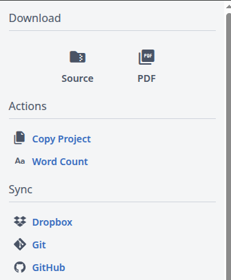

# NTUST 碩士論文 LaTeX 範本

本專案為國立臺灣科技大學碩士論文撰寫之 LaTeX 模板，提供完整章節架構、繁體中文樣式、插圖表展示、文獻引用格式與中英文摘要樣式。適合研究生、助教與課程教學使用。

## 專案結構

```txt
├── main.tex                 # 論文主檔案（編譯入口）
├── environment.tex          # 樣式與格式設定（字體、標題、浮水印等）
├── thesis_info.tex          # 論文資訊填寫區（姓名、題目、學位等）
├── references.bib           # 參考文獻資料庫（BibTeX 格式）
├── ntust.png                # 浮水印圖片（可自行更換）
├── front-pages/             # 封面、摘要、致謝等前置章節
│   ├── _frontpage.tex
│   ├── zh_abstract.tex
│   ├── en_abstract.tex
│   └── acknowledge.tex
├── main-pages/              # 正文各章節（五章）
│   ├── 1_introduce.tex
│   ├── 2_relative_work.tex
│   ├── 3_method.tex
│   ├── 4_result.tex
│   └── 5_conclusion.tex
└── figures/                 # 圖片資料夾
```

## 使用說明

1. 開啟 `main.tex`
2. 編譯方式建議使用 XeLaTeX（支援中文與字型）
3. 修改 `thesis_info.tex` 填入你的論文資訊
4. 修改 `main-pages/` 內容為你的研究內容

本範本在 [Overleaf](https://www.overleaf.com/read/mbytjqbxmsws#d67b90) 可以預覽，無需安裝任何環境。

打開範本的網址後，左上角的 Menu 點開，Copy Project 就可以複製一份到你的編輯區域了



## 檔案範例

- ✅ 中文與英文摘要
- ✅ 中文章節編號格式（如：「第⼀章」、「（一）」）
- ✅ 自動產生圖目錄、表目錄與參考文獻
- ✅ 插入圖表（含浮水印圖示）
- ✅ BibTeX 文獻管理，支援 RFC、IEEE、技術文件與網站引用
- ✅ 中英文樣式切換（`\UseChineseStyle` 以及 `\UseEnglishStyle`）
- ✅ printbibliography[heading=\<bibType>]
  - *bibType* 可以使用 zhbib 輸出「參考文獻」，或是 enbib 輸出「References」

絕大多數的你希望輸出的內容都可以在 `environment.tex` 客製化，目前的範例只是使用台科大的規格當作範例去設定，參考[台科大論文格式](https://etheses.lib.ntust.edu.tw/media/download/ed6370c8-7c81-11ee-b999-0242ac1f0806.pdf)

## 注意事項

- 範例中，圖片放於 `figures/` 目錄，建議使用 `.png`、`.jpg` 或 `.pdf` 格式
  - 如果希望區分不同章節用到的圖片，可以額外建立如 `figures/introduce`，`figures/method` 等資料夾
  - 對於其他素材，比方說你有 plot 的原始檔案，或是想要存放一些 log，也可以直接新增 `log`, `assets` 等資料夾
- `\InsertTable` 與 `\InsertFigure` 為自定指令，用來插入表格跟圖片
  - `\InsertTable` 滿容易壞掉的，畢竟表格編排起來比較複雜，如果真的有問題，建議還是自己撰寫表格的插入
  - `\InsertFigure` 也只是提供一個快速插入圖片的指令，需要更詳盡的調整，還是得要自己處理
- 若出現中文顯示問題，請確認使用 XeLaTeX 編譯器
- 本模板使用 AR PL 字型系列，Overleaf 可正常支援，如需自訂字體請修改 `environment.tex`

## 授權與貢獻

範例內容都是個人撰寫的，歡迎 fork、修改並分享給其他同學。
